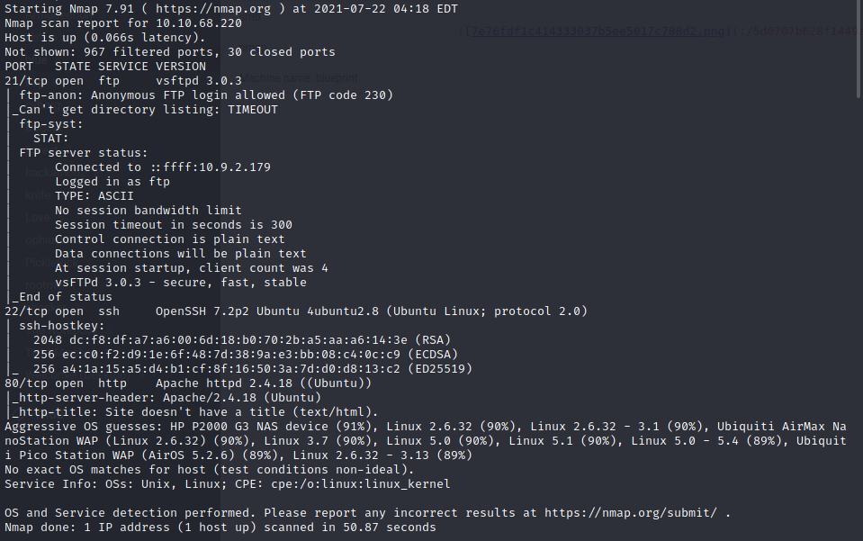
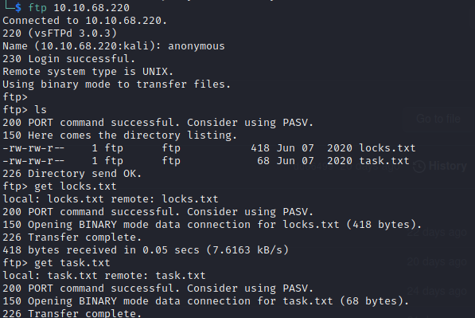
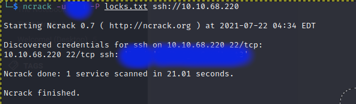
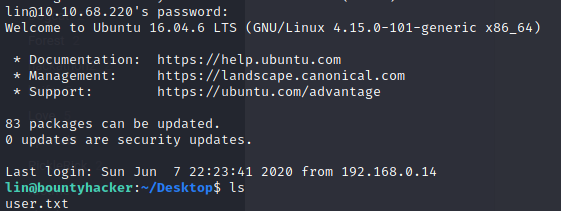
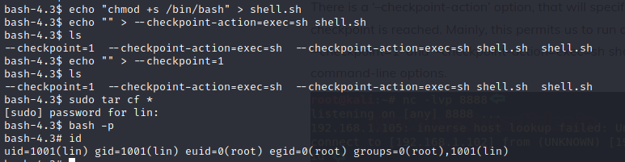
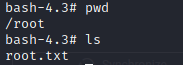

README.md

## **Machine name: Bounty Hunter**

### **1. Running nmap**

After running nmap, we were able to find 3 open port on the server: 21(ftp), 22(ssh) and 80(http). We were also able to find that ftp allows anonymous login.
### **2. Service enumeration**
#### **1. FTP**
We logged in using user anonymous to ftp and were able to find 2 files: locks.txt and task.txt. On checking the files after downloading them, we find that locks.txt had a list of words which could be password and we were also able to find the user who wrote tasks.txt

#### **2. ncrack**
We use the writer of task.txt and the list in locks.txt and use ncrack. We were able to get the password for the user.

### **3. Exploit**
As we have the password from ncrack, we can login to ssh:                                                

We were able to find the user.txt at /home/lin/Desktop
#### **1. Checking sudo permission**
On checking sudo permission granted to user, we see that the user can run tar using sudo. 

#### **2. Post exploit**
We use the [tar sudo exploit](https://www.hackingarticles.in/exploiting-wildcard-for-privilege-escalation/) here to set the sticky bit to bash.

#### **3. Final Flag**
We can then get the final flag at /root                                                       

