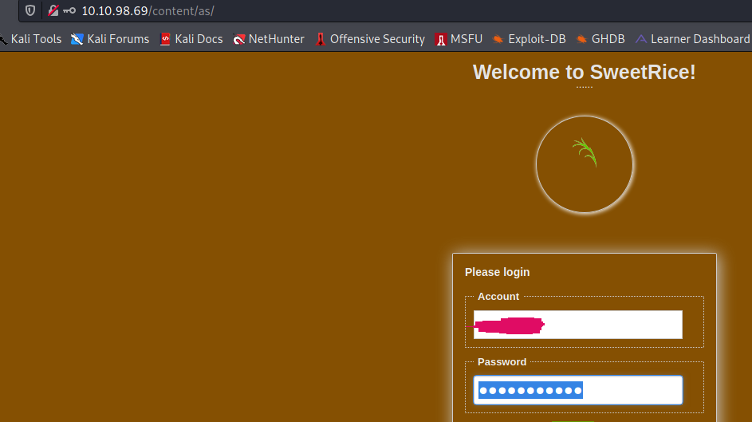
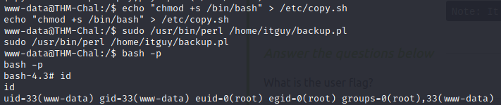

README.md

## **Machine name: Lazy Admin**

### **1. Running nmap**

After running nmap, we were able to find 2 open port on the server: 22(ssh) and 80(http).
### **2. Service enumeration**
#### **1. HTTP**
	1. We ran dirb and found the below directories

	2. On checking */content/inc*, we could find a mysql backup at */content/inc/mysql_backup/*

	3. We were able to find the username and the password in the sql files

	
	
	4. We were then able to login to the console at */content/as*

### **3. Foothold**
1. After gaining access to the dashboard we can uplload a reverse php script from the media center tab. We were not able to upload a php file, however, we were able to zip it and upload it after checking the extract zip option.

2. We can then start a reverse shell and access the reverse shell script from */content/attachment/*

### **4. First flag**
Once we have access to the reverse shell, we can get access to the first flag at 

### **5. Sudo permission**
When checking the sudo permission, we were able to find that the user can run a perl script using sudo privileges.

### **5. Exploit**
The user only has read right to the script

 

However, the user has write permission to shell script is executes. We therefore set a sticky bit on bash: 

We then run the script using sudo to get root access

#### **3. Final Flag**
We can then get the final flag at */root* 

