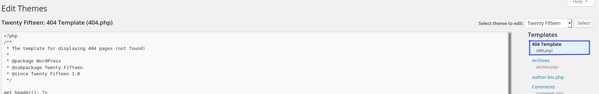

### Writeup for THM  Mr Robot

#### Enumeration
1. After running nmap, we were able to see 3 ports: 22 (ssh-closed), 80 (http), 443 (https)

2. We also ran dirb and got a list of available directories                                

#### Getting Foothold
1. On checking /0, we were able to find a wordpress blog.
2. On checking the /license, we were able to see that there is a base64 encoded string on checking it with firefox inspector

2. We then decoded the base64 text and were able to get the access to the wordpress using the credentials decoded from the string.

3. We were able to use the methods in https://www.hackingarticles.in/wordpress-reverse-shell/ to upload a reverse shell php to the system.
The steps are as follows:
    1. Go to Appearance/Editor in the wordpress dashboard.
    2. We then change the php script in 404.php to the reverse shell script. We used the reverse shell by Penetstmonkey and changed the ip address to our attacking
  machine. We also changed port to 4242.
    3. We start listening on our attacking machine on port 4242.
    4. Now we hit the 404.php from /wp-content/themes/twentyfifteen/404.php to get the reverse shell.
    

#### Flag 1
1. On checking robots.txt, we see that we can access key-1-of-3.txt

2. We then access the file to get the first key
      
#### Switching users
1. After getting the shell on our victim machine, we see that there is a file password.raw-md5 which is readable.

3. We pass this file through hashcat to get the password for the higher privilege user.
 
#### Flag 2
1. Now that we have switched to the other user, we can read the second flag.

#### Flag 3
1. We found that nmap has the sticky bit set:                                              

2. We were able to get the root access with following steps:
     1. start nmap in interactive mode
     2. When we check id, we see that while the id!=0, the euid is 0.
     3. We can start a shell using !sh and get the final flag!
  
  
  
 
